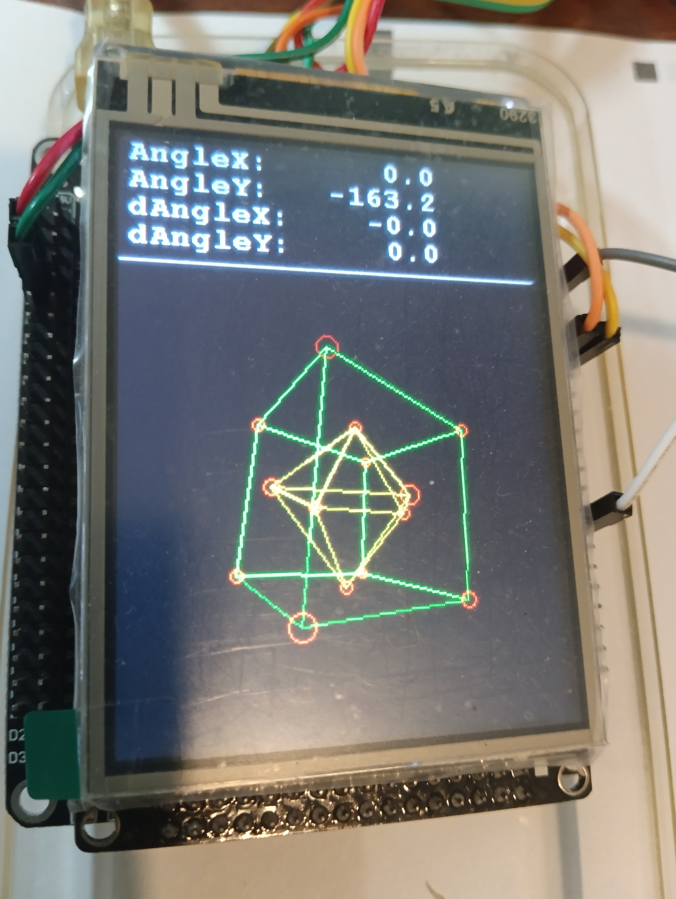

# RotatingCube

## Description

This is a project for the STM32F407VET6 board which uses the ILI9341 LCD display, MPU-6050 accelerometer and gyroscope. It displays a wireframe geometric shape with cubic symmetry that rotates in reaction to the gyroscope's movement. The measured angles, as well as the angle differentials in each iteration, are displayed.

## Libraries used:

- [ili9341 driver by Andriy Honcharenko](https://github.com/taburyak/STM32-ILI9341-320x240-FSMC-Library): provides functions for initializing the ili9341 display, as well as a variety of graphics functions for displaying text and drawing geometric figures.

- [mpu6050 driver by leech001](https://github.com/leech001/MPU6050): A library for interfacing with the MPU-6050 through an i2c connection. The functions used here are MPU6050_Init(), which initializes the device, and MPU6050_Read_All(), which reads the data from the gyroscope and calculates
the angle using a Kalman filter.

Check the libraries for instructions on setting up the peripherals.

## Adjustable parameters

These parameters appear in the global private variables section.

- ds: A structure of display settings that are passed to the render functions. These include:
	- res_x, res_y: horizontal and vertical resolution of the display.
	- center_x, center_y: The point on the display that corresponds to the z axis, where x = 0, y = 0.
	- fov: Field of view. The larger it is, the wider the view angle and the more pronounced the perspective is.
- cube_pos: The shape's center and pivot of rotation. The x and y values should stay 0, but z can be adjusted to make the shape closer or farther away.
- size: the shape's scale. Must be positive.
- atom_size: radius of the red bubbles. Must be non-negative.
- smooth_factor: How much should the gyroscope's jitter be smoothed. At 0, the angles from the gyroscope are unprocessed. When smooth_factor approaches 1, the movement becomes very slow.
- sensitivity: A larger value makes the shape rotate faster in response to the gyroscope's movements. Must be positive.
- angle_limit: A value used to handle angle differential overflow (crossing the border between 180 and -180). Should be larger than any reasonable single step in an angle, but also reasonably smaller than 360.
- colors of each graphical element in the scene.
 
## 3D Graphics

The project includes a library of structure definitions and functions that can be used to create and manipulate 2d and 3d graphical objects.

In order to use the graphical library in a different project, copy the following files:
- vector2.c
- vector3.c
- wire2.c
- wire3.c
- wireframe_render_ili9341.c

and the corresponding header files. In order to use them with a different display, edit the device-specific rendering functions in wireframe_render_ili9341.c.