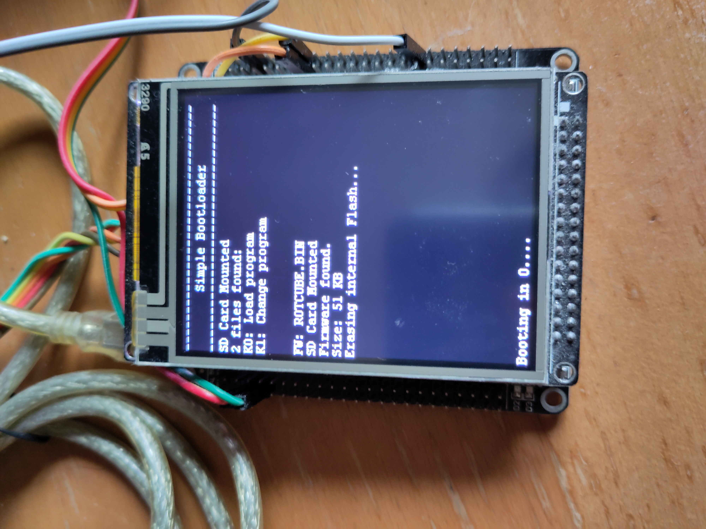

# Simple Bootloader

## Description

This is a project for the STM32F407VET6 board which uses the ILI9341 LCD display and an SD card drive. It implements a minimal bootloader capable of loading firmware files from an SD card through a simple interface.

The bootloader library is a modified version of the [Embertronix bootloader](https://embetronicx.com/category/tutorials/microcontrollers/stm32/bootloader/).

Binary files should be placed in the /bin directory. When the bootloader starts, the user has a limited time (5 seconds by default) to switch between the firmwares. The timer resets with each button press. When the timer ends, the flash memory is overwritten by the selected firmware. If none is selected, the existing firmware is loaded.